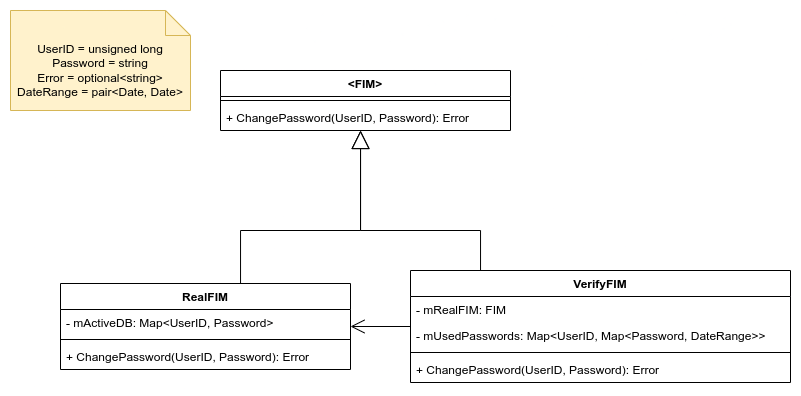

<!-- <style> -->
<!-- .markdown-body { -->
<!--     font-family: "Helvetica"; -->
<!-- } -->
<!-- .markdown-body code { -->
<!--     font-family: "Iosevka Extended"; -->
<!-- } -->
<!-- </style> -->

# SFRWENG 3A04: Assignment 2
**Author**: Luigi Quattrociocchi (quattrl)  
**Date**: April 12, 2023  


#### (a) Introduction

This repository showcases the **proxy** a software design pattern. A proxy, in its most general form, is a class functioning as an interface to something else. The proxy could interface to anything: a network connection, a large object in memory, a file, or some other resource that is expensive or impossible to duplicate. In short, a proxy is a wrapper or agent object that is being called by the client to access the real serving object behind the scenes[^1]. The included code implements this pattern with a simple example.

Suppose that you have a system (let's call this system the Federated Identity Management (FIM)) which stores user accounts. Users need to change their passwords, which need to be verified in some way before it is committed to the system. For this implementation we need to verify that the new password has never been used by the user before. This verification system can be expressed as a wrapper (or proxy) class on top of an existing identity management system (concrete subject) with the same external management system interface (abstract subject).

#### (b) Design of system

Notable files inside the `src` directory include:
```
└── src
    ├── main.cpp                         │ Example usage
    │
    ├── FIM.hpp                          │ Abstract subject
    ├── VerifyFIM.hpp/cpp                │ Real subject
    └── RealFIM.hpp/cpp                  │ Proxy subject
```

As shown in the class diagram, the abstract class `FIM` defines the `ChangePassword` function, which should be overridden by its concrete subclasses `RealFIM` and `VerifyFIM`. `VerifyFIM` acts as a proxy for the `RealFIM`, which actually stores user information. When the `ChangePassword` method is called on an instance of `VerifyFIM` and the verification is successful, the call is forwarded to the `RealFIM`.

The note in the top left shows the type aliases used; For simplicity, classes are not templated. Also, unimportant to the class design are two methods of `VerifyFIM`, `ToStream` and a constructor which takes an `istream&`. These methods are used to serialize and deserialize the set of used passwords and date ranges.

The following diagram shows the structure of classes in `src`. The main file is omitted. External client code only depends on `FIM`.



The following diagrams come from the famous book "Design Patterns: Elements of Reusable Object-Oriented Software"[^2], typically referred to as "The Gang of Four". Notice that the class diagram is nearly identical to the one above. Notably, more proxies can be added and chained together (not demonstrated here).


#### (c\) User guide

`src/main.cpp` has a fully commented example showing how to use the system. Pre-built binaries of this file are included: `A2.exe` (for Windows users) and `A2.out` (for Linux users). To run them, open the root directory of this repository in a terminal, then run the executable for your platform. If none of these options work for you, the build scripts can easily be modified (they are only a few lines long) to support other compilers (such as clang) and flags.

##### Windows (msvc)

Build:  
*NOTE: Run this from an MSVC enabled terminal (such as `Developer Command Prompt for VS 2022`)*
```console
> .\make.bat
```
Run:
```console
> .\A2.exe
```

##### Linux (gcc)

Build:
```console
$ ./make.sh
```
Run:
```console
$ ./A2.out
```

#### References:
[^1]: https://en.wikipedia.org/wiki/Proxy_pattern
[^2]: https://archive.org/details/designpatternsel00gamm/page/207